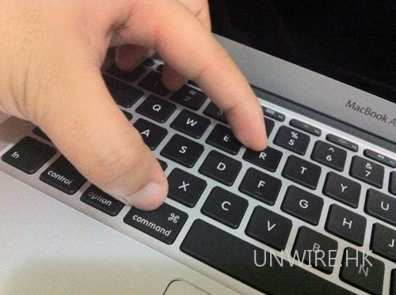

### 给苹果电脑装系统
1. 首先在 MacBook Air 关上的情况下，按着 Command 及 R 两个按键不放手，然后同时按下最右上角的开关键一下(记着此时仍然继续按着 Command + R 键)。

2. 选择第二项`Reinstall Mac OS X`

3. 选择`右上角`输入法为`简体拼音`，并连接wifi

4. 如出现：`无法连接到服务器 `的错误，一般都是时区的问题。

#### 参考
[知乎](https://www.zhihu.com/question/282626105)
[Mac OS X如何重装](https://product.pconline.com.cn/itbk/software/osx/1208/2894364.html)

### 关键评论
点击右上美国国旗 ，切换为简体中文。

1、返回 MacOS 适用工具界面。2、在电脑左上角找到“终端”并打开。3、输入 date，然后回车，检查时间是否正确，如不正确，按照“date 月日时分年” 的格式输入指令重置时间。比如现在是 2020 年 7 月 5 日 15 点 22 分，那就输入“date 0705152220”。

作者：森淼
链接：https://www.zhihu.com/question/282626105/answer/1320187233
来源：知乎
著作权归作者所有。商业转载请联系作者获得授权，非商业转载请注明出处。