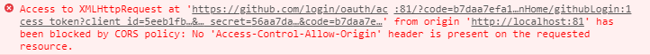

### 什么是跨域
>跨域问题的出现是因为浏览器的同源策略问题，所谓同源:就是两个页面具有相同的协议（protocol），主机（host）和端口号（port），它是浏览器最核心也是最基本的功能，如果没有同源策略我们的浏览器将会十分的不安全，随时都可能受到攻击。
当我们请求一个接口的时候，出现如：`Access-Control-Allow-Origin` 字眼的时候说明请求跨域了


### 配置方式
[proxy官方参考](https://cli.vuejs.org/zh/config/#devserver-proxy)
[跨源资源共享（CORS）](https://developer.mozilla.org/zh-CN/docs/Web/HTTP/Access_control_CORS)
- vue.config.js配置代理
```js
    proxy: {
      '/apiddd': {
        target: 'https://github.com/login/oauth/access_token',
        ws: true,
        changeOrigin: true,
        pathRewrite: {
          /* 重写路径，当我们在浏览器中看到请求的地址为：http://localhost:8080/api/core/getData/userInfo 时
            实际上访问的地址是：http://121.121.67.254:8185/core/getData/userInfo,因为重写了 /api
           */
          '^/apiddd': ''
        }
      }
    }
```

### 注意事项
- 默认是使用的80端口。所以，如果你修改了项目端口。你在设置baseurl时需要对应的修改你的端口号。

### 参考
[vue解决跨域问题](https://www.cnblogs.com/lihaohua/p/12372267.html)